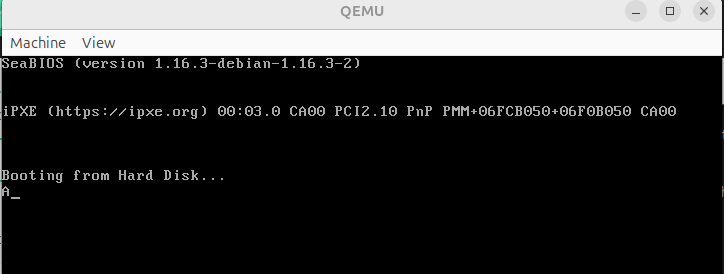

# Minimal BIOS Bootloader (16‑bit Real Mode)

This repository contains a simple **BIOS bootloader** written in x86 assembly that runs in **16‑bit real mode** and prints a character on the screen.

A bootloader is the very first code executed by a PC when it boots — the BIOS loads the first 512‑byte sector (called the boot sector) into memory and then jumps to it. This code runs **without any operating system under it**.


## What It Does

* Runs in 16‑bit real mode
* Uses BIOS video interrupt to print a character
* Loops forever after display
* Fits exactly in one 512‑byte boot sector
* Recognized as bootable by BIOS because of the **0xAA55 signature** at the end of the sector

This is a **first‑stage bootloader**, its job is to run first and can later be extended to load a full kernel.

## Files

| File | Description |
|------|-------------|
| `boot.asm` | the assembly source for the bootloader |
| `boot.bin` | the assembled 512‑byte binary boot sector |

## Build

You need **NASM** (Netwide Assembler) and **QEMU Emulator** installed:
* First command create **boot.bin** file
* Second command execute and display output
```bash
nasm -f bin boot.asm -o boot.bin

qemu-system-x86_64 boot.bin
```
Here, the character **A** printed in QEMU Emulator screen:


